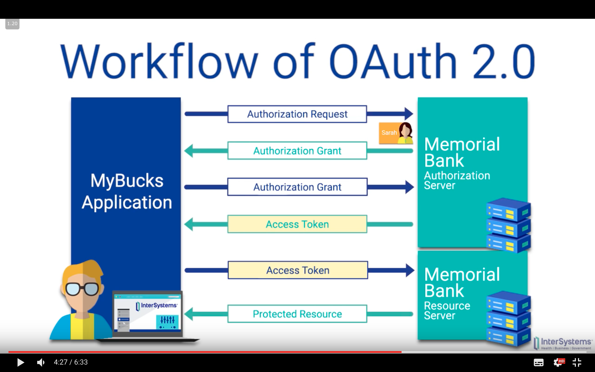
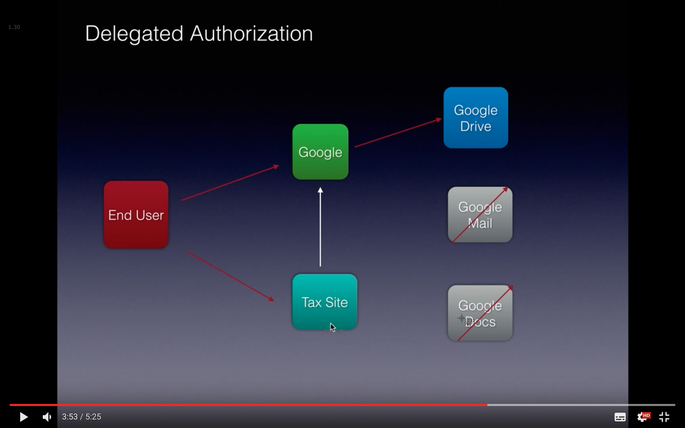

# Authentication and Authorisation in Hapi - Notes

Authentication within hapi is based on the concept of `schemes` and `strategies`.

## Scheme (a general type of auth, like "basic" or "digest") and Strategy (a pre-configured and named instance of a scheme).
  
Think of a `scheme` as a general type of auth, like `"basic"` or `"digest"`. You can think of a scheme as a template for authentication. A scheme isn’t used directly to authenticate users - instead you create a specific strategy from the scheme.

A `strategy` is a pre-configured and named instance of a scheme. Strategies exist so you can use the same scheme several times, in a slightly different way. For instance, might decide to you want use basic authentication in your app. For some routes you might wish to validate a user’s passwords against a value in a database and for some other routes, you might wish to check the password against a value stored in a text file. In this case you can create 2 different strategies from the scheme.

Some authentication schemas are available as a plugin for HAPI:

* [hapi-auth-basic](https://github.com/hapijs/hapi-auth-basic)
Generic browser pop up with username and password

* [hapi-auth-cookie](https://github.com/hapijs/hapi-auth-cookie)
Provides simple cookie-based session management. Upon validation user receives a session cookie.
Can be used in compination with `hapi-context-credentials` to make credentials available globally.

* [hapi-auth-bearer-token](https://github.com/johnbrett/hapi-auth-bearer-token)
Bearer authentication requires validating a token passed in by either the bearer authorization header, or by an access_token query parameter.


### hapi-auth-cookie example

```javascript
const cookieAuthModule = require('hapi-auth-cookie');
const contextCredentials = require('hapi-context-credentials');


const server = new hapi.Server();


server.connection({
  port: process.env.PORT || 3000
});


// register a cookie scheme: 'hapi-auth-cookie'
server.register([vision, inert, cookieAuthModule, contextCredentials], err => {
  if (err) {
    throw err;
  }
  
  // Once you've registered your scheme, you need a way to use it. This is where strategies come in.
  // Register a strategy with a name 'base', you are free to call it what you like
  server.auth.strategy('base', 'cookie', 'optional', {
    password: process.env.COOKIE_PASSWORD,
    cookie: 'name-of-cookie-on-client',
    isSecure: false, // set to false to make it work on localhost
    ttl: 24 * 60 * 60 * 1000
  });

  server.route(routes);
  server.views(handlebars);

});
```

User completes an html form:
```html

<form action="/login-post" method="POST">
  <input type="text" name="username" placeholder="Enter username" required />
  <input type="password" name="password" placeholder="Enter password" required />
  <button type='submit'>Submit</button>
</form>
```

Then in the `/login-post` `POST` handler you can access this info and set a cookie after user has been authenticated

```javascript
request.cookieAuth.set({
  username: request.payload.username,
  passord: request.payload.password
});
```

Then the above credentials can be accessed on the request object in other handlers:
```javascript
console.log(request.auth.credentials.username)
```

To clear a cookie:
```javascript
request.cookieAuth.clear();
```

## Authentication vs Authorisation

- Authentication is about validating that a user really is who they claim to be and authorization is about the permissions of the user and what they have access to.

## Bcrypt

### Hashing

Hashing is a way of encrypting an input string. It is a one way process, so hashing a password will  An ideal hash function has five properties:

1. It is deterministic (the same input always results in the same output hash).
2. Computing a hash is fast.
3. It is infeasible to reverse the process and get the input value from the hash (i.e. usually the only method is brute-forcing by comparing every possible value until a match is found, which takes huge amounts of time for a long enough hash).
4. A small change to the input should change the hash enough that there is no correlation between the new and old hashes.
5. It is unlikely that two inputs will produce the same hash value.

### Salting

Salting involves adding random data to the input to the hashing function, to protect against certain kinds of attacks (like dictionary or rainbow table attacks).

Since salts do not have to be memorised by humans they can make the size of the rainbow table required for a successful attack prohibitively large without placing a burden on the users.

Since salts are different in each case, they also protect commonly used passwords, or those who use the same password on several sites, by making all salted hash instances for the same password different from each other.

### Practical application

Bcrypt is a library for hashing passwords. It provides functions for salting and hashing a plaintext password string.

The general idea is to hash a password when a user first creates it, then store the hashed password in a database. When the user tries to log in later you hash the password they provide and compare this hash to the stored hash in the database. If the hashes match that means the passwords are the same, so the user is authenticated.


## Resources

[Cookie auth in Hapi](https://medium.com/@poeticninja/authentication-and-authorization-with-hapi-5529b5ecc8ec)

[Bcrypt docs](https://www.npmjs.com/package/bcrypt)

[Authentication tutorial](https://hapijs.com/tutorials/auth)


## OAuth flow 
https://www.youtube.com/watch?v=0PvQcLzVGF0

If you want to share your account details with an application (client) your don't want to share your username and password. What you can do is to give a revokable access token to an application so that they can access your info (for example username and profile photo).

OAuth is an open standard for authorization, commonly used as a way for Internet users to authorize websites or applications to access their information on other websites but without giving them the passwords. This mechanism is used by companies such as Google, Facebook, Microsoft and Twitter to permit the users to share information about their accounts with third party applications or websites.

Generally, OAuth provides to clients a "secure delegated access" to server resources on behalf of a resource owner. It specifies a process for resource owners to authorize third-party access to their server resources without sharing their credentials. Designed specifically to work with Hypertext Transfer Protocol (HTTP), OAuth essentially allows access tokens to be issued to third-party clients by an authorization server, with the approval of the resource owner. The third party then uses the access token to access the protected resources hosted by the resource server.

The trust between the application and authorization server includes:
- client ID
- client secret
- redirect callback URL (on client application)


https://www.youtube.com/watch?v=L1PDqJkedZ0


In the above examle: OAuth is responsible to authorisation and OpenID Connect looks after authentication (access tokens).



The user had delegated authorization to a tax site to access google drive.

1. User hits “Login with Facebook”
1. Facebook SDK talks to Facebook backend to get a token
1. Your client gives your backend the token
1. Your backend validates the token against Facebook’s servers
1. Your backend issues a new authentication or session token
1. Your client saves your backend’s auth token: Now you’re logged in and can talk to your own servers forever, or at least in a way you understand.

### OAuth 2 Real life analogy
http://stackoverflow.com/questions/4727226/on-a-high-level-how-does-oauth-2-work

How OAuth 2.0 works in real life:

So I was driving by Olaf's bakery on my way to work and I saw the most delicious donut in the window, I mean the thing was dripping chocolatey goodness. So I went inside and demanded "I must have that donut!". He said sure that will be $30.

Yeah I know $30 for one donut! It must be delicious! I reached for my wallet when suddenly I hear the chef yell "NO! No donut for you". I asked why? He said he only accepts bank transfers.

Seriously? Yep, he was serious. I almost walked away right there, but then the donut called out to me. It said "Eat me, I'm delicious..." Who am I not to obey the orders of a donut.

So I said ok. He hands me a note with his name on it (the chef not the donut), "Tell them Olaf sent you". He wrote his name on the note, I don't know why he said that, but ok.

So I drive an hour and a half to my bank. I hand the note to the cashier, I tell her Olaf sent me. She gives one of those looks, the kind of look that says "I can read".

She takes my note, asks for my id, then asks me how much money is ok to give him. I tell her $30 dollars. She does some scribbling and hands me another note. This one has a bunch of numbers on it, I guess that's how they keep track of the notes.

At this point I'm starving. I rush out of there, an hour and a half later I'm standing in front of Olaf with my hand extended to his face. He takes my note, looks it over and says "I'll be back".

I thought he was getting my donut, but after 30 minutes I started to get suspicious. So I asked the guy behind the counter "Where's Olaf?". He says "He went to get money". "What do you mean?", "He take note to bank".

Huh. So Olaf took the note that the bank gave me and went back to the bank to take out money from my account. Because he has the note that the bank gave me, the bank knows he's the guy I was talking about. And they know to only give him $30 because I told them that's all I would allow them to give him.

It must have took me a long time to figure that out because by the time I looked up there was Olaf standing in front of me finally handing me my donut. Before I left I had to ask "Olaf, did you always sell donuts this way?", "No, I used to do it different."

Huh. As I walked to the car my phone rings. I didn't bother answering, it was probably my job calling to fire me, my boss is such a ***. Besides I was caught up thinking about this whole process I just went through.

I mean think about it, I was able to let Olaf take $30 out of my bank account without having to give him my account information. And I didn't have to worry that he would take too much because I already told the bank he was only allowed to take $30. And the bank knew he was the right guy because he had the note they gave me and I gave to Olaf.

Ok, sure I would rather have given him $30 from my pocket. But now that he has that note I could just tell the bank to let him withdraw $30 each week, then I can just show up at the bakery and I don't have to go to the bank anymore. I could even order the donut by phone.

Of course I'd never do that - that donut was disgusting.

I wonder if this approach has broader application. He mentioned this was his second approach, I could call it Olaf 2.0. Anyway I better get home, I gotta start looking for a new job. But not before I get one of those strawberry shakes from that new place across town, I need something to wash away that taste of that donut.

# OAUTH2
https://gist.github.com/mziwisky/10079157
 
## The Problem
I’m a web app that wants to allow other web apps access to my users’ information, but I want to ensure that the user says it’s ok.
 
## The Solution
I can’t trust the other web apps, so I must interact with my users directly.  I’ll let them know that the other app is trying to get their info, and ask whether they want to grant that permission.  Oauth defines a way to initiate that permission verification from the other app’s site so that the user experience is smooth.  If the user grants permission, I issue an AuthToken to the other app which it can use to make requests for that user's info.
 
### Note on encryption
Oauth2 has nothing to do with encryption -- it relies upon SSL to keep things (like the client app’s shared_secret) secure.
 
## Example Scenario:
Gmail wants to allow some 3rd party app, PrettyMail, to do stuff with its users’ information.
 
```
Gmail stores server-side:      PrettyMail stores server-side:      Note: client_id tracks the user of the
  oauth_clients: [               client_id: ABC                    oauth privileges, i.e., PrettyMail or 
    pretty_mail: {               shared_secret: XYZ                other web app -- not the end-users
      client_id: ABC
      shared_secret: XYZ
    }, ...]
```
 
1. I visit PrettyMail and click “Login thru GMail”

2. PrettyMail responds REDIRECT gmail.com/oauth2/auth?client_id=ABC&redirect_uri=prettymail.com/oauth_response
  -- note: also common to include ‘scopes’ in query -- i.e., the scope of the information that PrettyMail is asking to access

3. gmail makes a session in which it stores provider (PrettyMail, based on client_id -- if client_id doesn’t refer to an authorized oauth_client, render an error) and redirect_uri and then responds:

    a. REDIRECT gmail.com/login (for a login form) if the user isn’t logged in, otherwise

    b. REDIRECT directly to step (4)

4. gmail shows a page saying “PrettyMail (got that from the aforementioned session) wants to access this, that, and the other thing (again, ‘scope’ of access was stored in the session) about your Gmail account.  Do you authorize?”  You click “yup” and gmail:

5. generates a one-time-use code that it associates with PrettyMail and the specified user and the requested scope (so it persists it until the next step) and REDIRECTs to the ‘redirect_uri’ it got in the first place, passing along that code: prettymail.com/oauth_response?code=big_long_thing

    Question: why not pass the AuthToken itself along at that step?  Answer: so gmail can ensure that PrettyMail is indeed the requester of the access -- so far, all the requests gmail has gotten have come directly from the user, and the only information that identified PrettyMail was its client_id, which isn’t “secret” (i.e. an attacker could guess it).  So GMail so far is confident that the user is ok with everything, but isn’t yet convinced that PrettyMail is really going to be the one using the Token.  That’s where the next request comes in, in which PrettyMail identifies itself by including the shared secret.
    
    Other Question: rather than redirecting to a URL containing the code as a param, why not just send the final AccessToken to PrettyMail right then and there?  Answer: (i’m guessing) the redirect basically “gives control” of the browser back to PrettyMail, so they can handle the request any way they want.

6. PrettyMail takes the code and directly (i.e., not via a REDIRECT in the user’s browser, but via a server-to-server request) queries GMail with both code and shared secret, to prove its identity: GET gmail.com/oauth2/token?client_id=ABC&client_secret=XYZ&code=big_long_thing

7. gmail verifies and then invalidates the code, and responds with an AccessToken, which PrettyMail can then use (until it expires) to make API requests on the user’s behalf (i.e., to get info about the user, and possibly to perform actions on behalf of the user, if that was in the agreed-upon ‘scope’ of the arrangement)

## Persisting Facebook “connectedness” across logins and devices

Once a user signs in with Facebook, she might sign in with another service under the same email address. Or a different user might “Connect” his account to Facebook later, which should associate his Facebook session with his user account in the backend.

But when these guys sign in on another device, or if they sign out and sign back in (without tapping “Login with Facebook”), the Facebook SDK in the client might not know about their Facebook sessions anymore.
Additionally, the only way to keep sessions alive is to refresh them in the client; there’s no facility for doing this on the server.

So, to wire the session back up, when a user who has logged in with Facebook (or connected his or her Facebook account) logs back in, your app should do the following:

1. Load any recent third-party sign-in tokens from your backend
1. Re-create the Facebook/Google login sessions and issue a request
1. Check the auth token. If it has changed, save the new token to your backend to keep the session alive.

You can replicate this behavior on Android and the web so that when a user signs into a different client, you can silently keep them connected.


## OAuth vs OpenID

OpenID = using login credentials from an OpenID provider (Google) to login to another application (Stack Overflow)

OAuth = Allowing an application (TwitPic) to act on your behalf to and access information from an application that you use (Twitter).


## SSL vs TLS vs HTTPS

### SSL
Secure Sockets Layer (SSL) is a cryptographic protocol that enables secure communications over the Internet. SSL was originally developed by Netscape and released as SSL 2.0 in 1995. A much improved SSL 3.0 was released in 1996. Current browsers do not support SSL 2.0.

### SSL
Transport Layer Security (TLS) is the successor to SSL. TLS 1.0 was defined in RFC 2246 in 1999. The differences between TLS 1.0 and SSL 3.0 were significant enough that they did not interoperate. TLS 1.0 did allow the ability to downgrade the connection to SSL 3.0. TLS 1.1 and TLS 1.2 are the later editions in the TLS family. Current browsers support TLS 1.0 by default and may optionally support TLS 1.1 and 1.2.

### HTTPS
Hypertext Transfer Protocol Secure (HTTPS), or “HTTP Secure,” is an application-specific implementation that is a combination of the Hypertext Transfer Protocol (HTTP) with the SSL/TLS. HTTPS is used to provide encrypted communication with and secure identification of a Web server.


